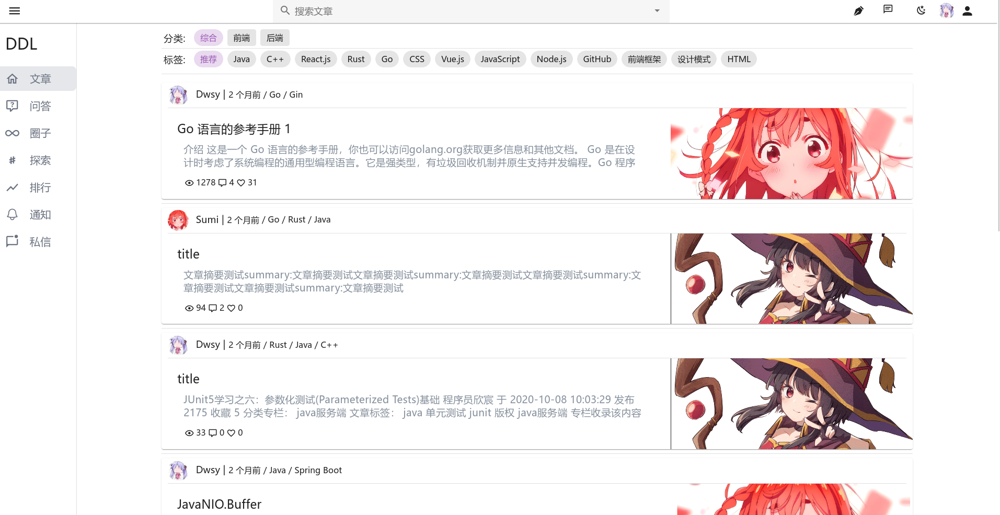
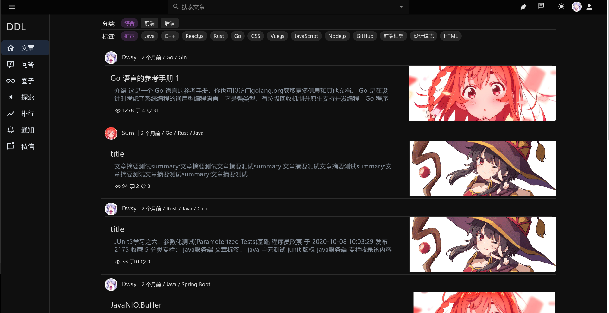
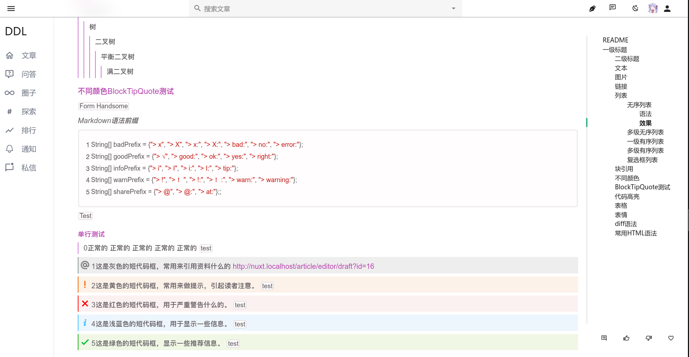
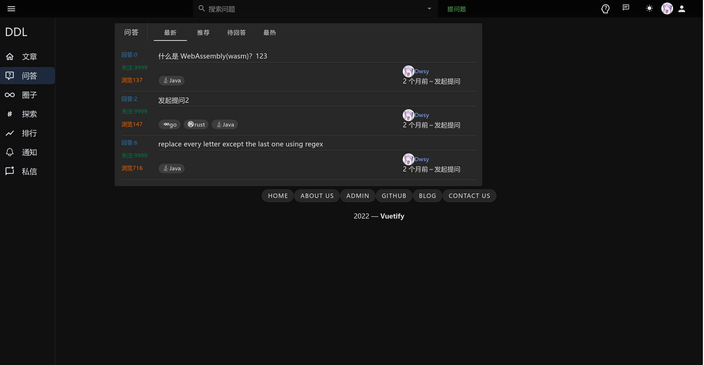
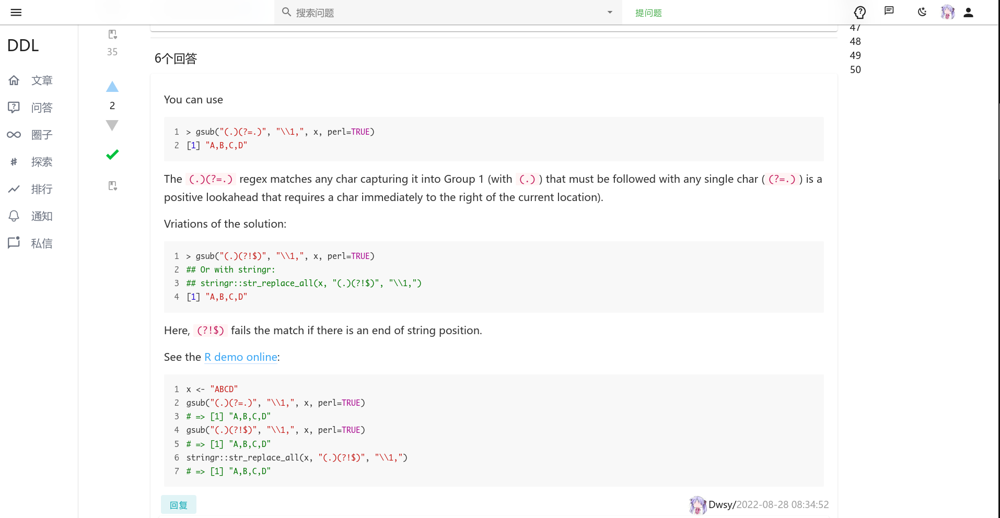
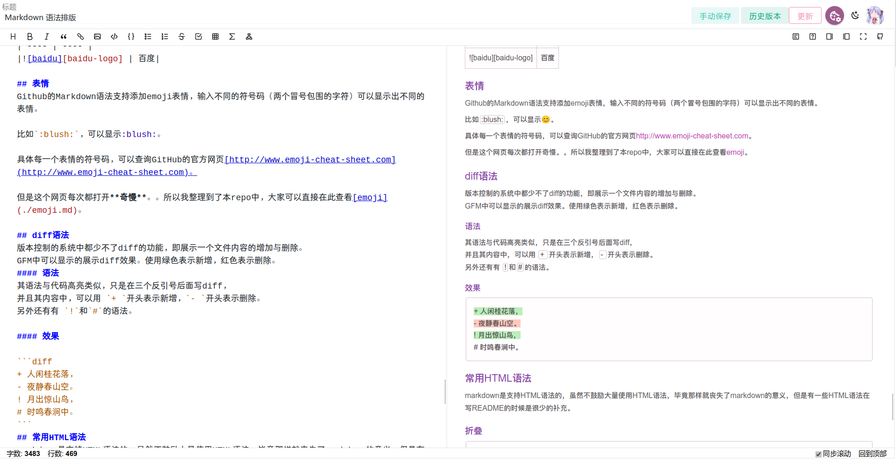
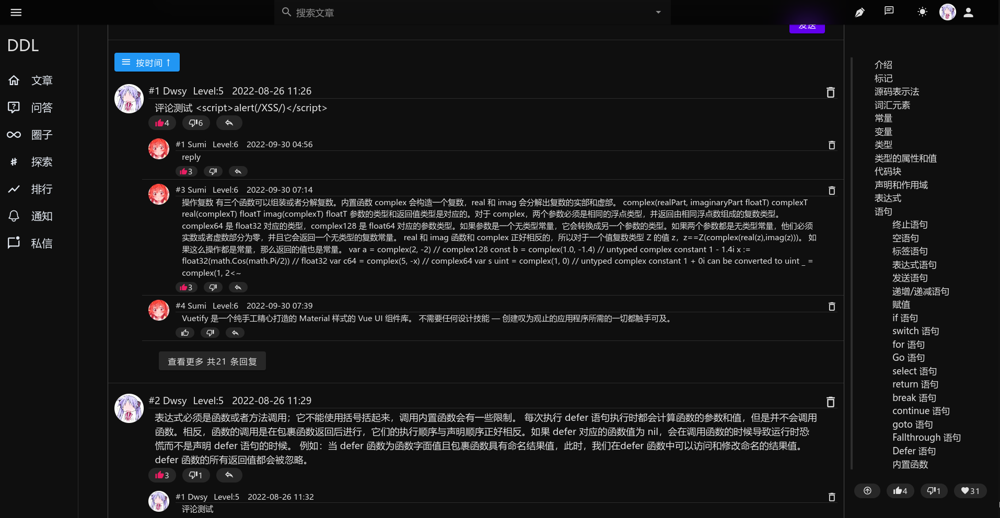
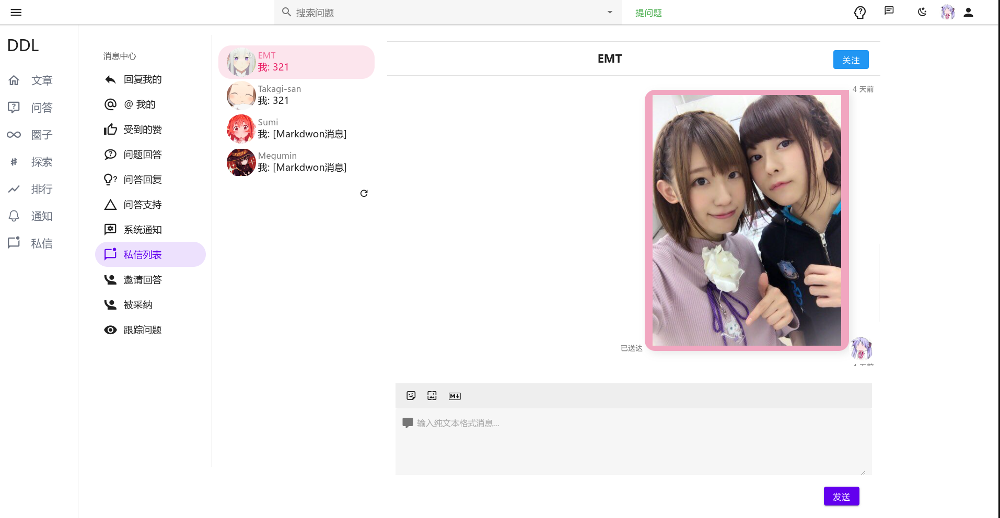

## DDL-front (D-DeveloperLink)

### 开发者社区前端

#### 项目介绍

---

技术栈：Vue3+Nuxt3+Vuetify+Axios+Typescript+Pinia+Tailwindcss

后端地址：[https://github.com/Dwsy/DDL](https://github.com/Dwsy/DDL)
拉取后修改env.example文件为.env可直接通过mock地址运行

---

Mock地址：https://ddlmock.dwsy.link/

ApiFox地址：https://ddlddlddl.apifox.cn

#### 页面截图

